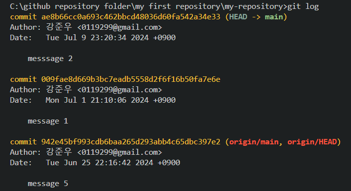
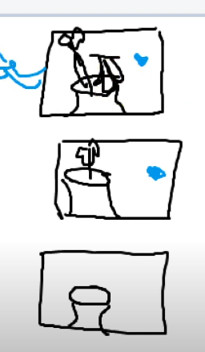
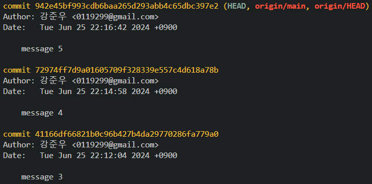
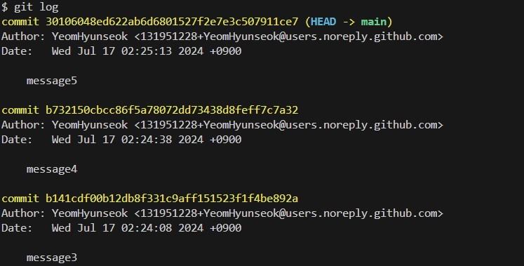
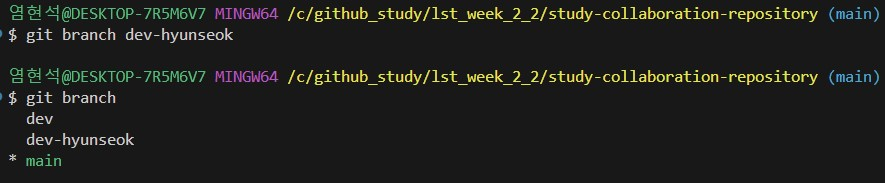
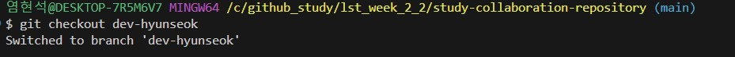
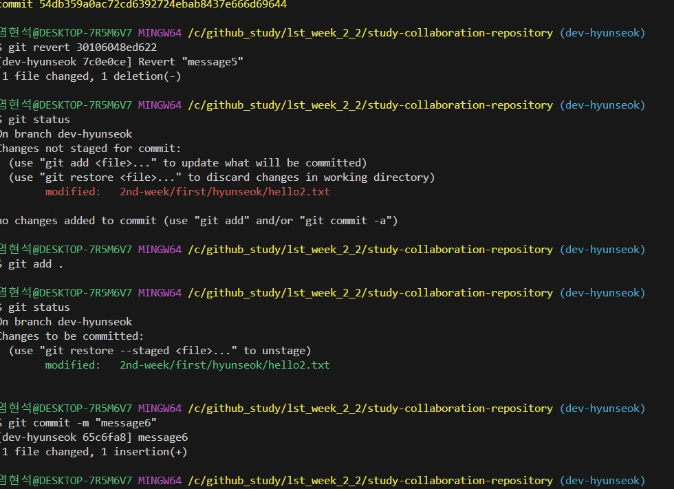

# CLI 버전관리
1. CLI 버전관리란 무엇인가?
2. git log를 치면 나오는 HEAD는 어떤 의미가 있나요?

- 모든 브랜치에는 head값이 존재하는데 head란 해당 브랜치의 마지막 커밋을 뜻한다


3. 아래 그림(fig. 1)에서 최신 버전에서 두번째 버전으로 돌아가려면 어떤 명령어를 써야하나요(커밋 메세지가 "message 1"인 버전)
```bash
...
code git checkout 009fae8d    # 코드 주석
...
```
*fig 1. git log 시 결과* <br>

4. main branch의 최신 버전으로 돌아가려면 어떤 명령어를 써야하나요?

- git checkout main 혹은 git branch


5. HEAD, HEAD -> main(혹은 master)는 어떤 차이가 있나요?

- HEAD는 HEAD는 현재 체크아웃된 커밋을 가리키는 포인터. 즉, 현재 작업 중인 브랜치의 최신 커밋을 가리킵니다.

-  HEAD -> main은 현재 체크아웃된 브랜치가 main 브랜치임을 나타냅니다. 즉, HEAD가 main 브랜치를 가리키고 있음을 의미.

# add 옵션, Editor
1. `git commit -am "message"` 에서 -am은 -a, -m 옵션이 합쳐진 것입니다. 각각은 어떤 의미를 가지는 옵션인지 말해보세요.

- a : untracked file 제외하고 tracking 파일중 수정한 파일 모두를 staging area (index ) 에  추가.

- m : commit 할 메세지

- am: add과정을 할 필요없이 tracking파일중 수정한 파일을 바로 staging area에 추가한다.

2. `git commit -am "message"`에서 -a 옵션은 실수를 방지하기 위한 조건이 있습니다. 조건이 무엇인가요?

- tracking을 하고 있어야 한다.

3. `git config --global core.editor "vim"`의 뜻을 설명해보세요.

-  현재 에디터를 vim에디터로 전환한다.

# git reset, revert
1. 위 그림(fig. 1)에서 `git reset --hard 009fae8d669b3bc7eadb5558d2f6f16b50fa7e6e`을 하면 결과가 어떻게 되나요?

- 위에 commit message 1으로 버전이 돌아간다. 한 reset은 아예 현재가 없었던 것 처럼 원하는 과거로 돌아갈 수 있다. reset은 이력을 남기지 않는다

2. `git revert 009fae8d669b3bc7eadb5558d2f6f16b50fa7e6e`을 하면 결과가 어떻게 되나요?

-  message 1까지 없어지는데 conflict가 발생한다.
 revert같은 경우는 과거 이력을 남기고 과거로 돌아간다.차례차례 돌아가야한다. 

3. `git reset ...`과 `git revert ...`는 의미가 비슷한데, 용도에 차이를 두고 사용한다면 어떤 차이가 있나요?

-  reset은 과거로 돌아가는데 commit이력이 남지않고
- revert 는 과거이력을 남기면서 차례차례 돌아가야한다. 

# tag, branch
1. tag는 왜 쓰이고 무엇을 대신하는 건가요?
- 각각의 버전을 식별하는 식별자인 commit ID는 기억하기 쉽지 않으므로
적당한 이름을 사용하는데 이를 tag라고 한다.

2. branch는 생성한다는 것은 어떤 의미인가요?

- 우리의 저장소를 여러가지 상태로 공존할 수 있게 해줌 .하나의 파일로부터 조금씩 다른 내용을 수정해서 제공 해야하는 경우,branch를 이용하면 저장소의 이름을 더럽히지 않고
(여러 번 변경하는 수고를 하지 않고)하나의 저장소에서 다양한 작업을 진행할 수 있음


# branch
1. branch는 왜 필요한가요?
- 1) 독립된 작업 공간 제공
- 2) 작업 분리
- 3) 안정한 통합 가능

2. 아래 fig 2.와 fig 3.의 그림과 커밋을 순서대로 각각 대응 시켰을 때, 두 번째 그림에서 새로운 그림을 그리기 위해 분기(branch)를 생성하려면 어떻게 해야하는 지 코드를 작성해주세요 (HEAD는 맨 위 그림 즉, 최신 버전을 가르치고 있음.) 

- 1) git branch dev-hyunseok
- 2) git checkout dev-hyunseok
- 3) git revert 942e45bf993
- 그 후 원하는 그림을 그리고 commit


 *fig 2.*<br>
 *fig 3.*<br>

3. 각자의 main branch의 최신 버전에서 `dev-{이름} (예: dev-junwoo)`이라는 브랜치를 만들고 (branch가 고장난 것 같으면 `dev-junwoo_1`처럼 만들어도 됩니다.)
4. 이 과제를 작성하고 본인의 remote repository로 push 한 뒤
5. 강준우 repository에 `dev`라는 branch에 PR을 날려보세요. (push가 안될 경우 `git push --set-upstream dev-{이름}`로 push 해보세요.)
6. 다했으면 하는 과정 각각을 스크린샷해서 여기에 올려주세요. 드래그앤 드랍으로 하면 됩니다.

 *fig 4.*<br>
 *fig 5.*<br>
 *fig 6.*<br>
 *fig 7.*<br>

### Advanced
1. HEAD 옆 origin/main, origin/dev, origin/HEAD는 무슨 뜻일지 추측해보세요.
2. `git checkout -b {branch_name}`에서 -b 옵션은 '{branch_name}라는 이름으로 새로운 브랜치를 만든다.' 이 명령어 결과와 같은 결과를 만드는 명령어를 찾아보세요.
3. `git config ...`에서 바꿀 수 있는 다른 명령어들은 무엇이 있나요? 맘에 드는 설정을 바꾼 뒤 알려주세요.
4. `git reset --hard ...`처럼 `git reset`에는 `--hard` `--mixed` `--soft`등 옵션이 있는데 이 옵션이 어떤 차이가 있는지 알려주세요.
5. 자주 사용되는 branch의 이름들이 몇 가지가 있습니다. 어떤 것들이 있고 무슨 이유로 그 branch를 사용하는지 2가지만 알려주세요.

